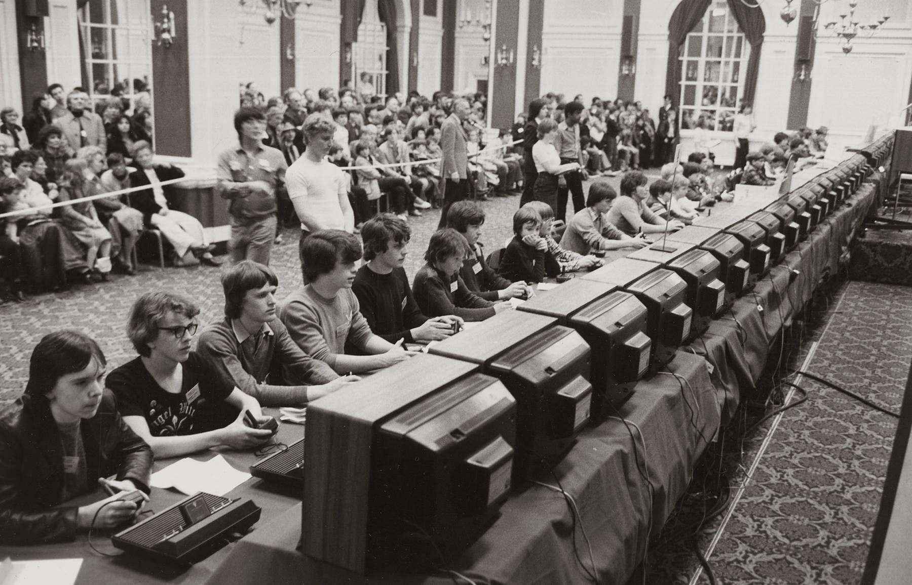
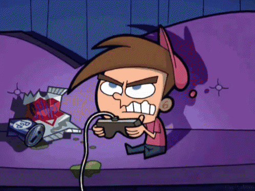

  
```{r packages-setup, include = FALSE}
library(tidyverse)
# remotes::install_github("rlesur/klippy")
library(klippy) 
library(knitr)
```

```{r chunk-setup, include = FALSE}
knitr::opts_chunk$set(echo = TRUE, eval = TRUE, message = FALSE, warning = FALSE, 
                      #results = "hold",
                      cache = FALSE, cache.path = "/caches/", comment = "#>",
                      #fig.width = 7, #fig.height= 7,   
                      #out.width = 7, out.height = 7,
                      collapse = TRUE,  fig.show = "hold",
                      fig.asp = 7/9, out.width = "60%", fig.align = "center")
#- para mejorar los gráficos, bueno en realidad para que se vean igual en distintos SO
#- https://www.jumpingrivers.com/blog/r-knitr-markdown-png-pdf-graphics/
knitr::opts_chunk$set(dev = "png", dev.args = list(type = "cairo-png"))
```

```{r options-setup, include = FALSE}
options(scipen = 999) #- para quitar la notación científica
options("yaml.eval.expr" = TRUE) #- https://github.com/viking/r-yaml/issues/47  (lo puse x el pb con el warning) En realidad creo que mejor sería ponerlo en RProfile
```


```{r klippy, echo = FALSE}
klippy::klippy(position = c("top", "right")) #- remotes::install_github("rlesur/klippy")
```

``` {css, echo=FALSE}
body { background-color: rgba(255, 110, 0, 0.2) /* 55% opaque white */;
  padding: 0.10em;
}
```

<div style="text-align: justify"><div/>

<hr class="linea-black">

Trabajo elaborado para la asignatura "Programación y manejo de datos en la era del Big Data" de la Universitat de València durante el curso 2020-2021. El repo del trabajo está [aquí](https://github.com/Andreuesparza/trabajo_BigData){target="_blank"}. La página web de la asignatura y los trabajos de mis compañeros pueden verse [aquí](https://perezp44.github.io/intro-ds-20-21-web/07-trabajos.html){target="_blank"}.

<hr class="linea-black">

## 1. ¿Por qué los esports?

Los esports son un sector en constante expansión y crecimiento. Pero, primero que todo: 
<FONT COLOR="FF4D00">**¿Qué entendemos por esports?**</FONT>


**Los esports o deportes electrónicos son una parte que complementa el campo de los videojuegos** Este concepto se utiliza para nombrar las competiciones organizadas a nivel profesional o semiprofesional donde diferentes personas de todo el mundo compiten por ser los mejores. Estas competiciones multijugador se dan en diferentes  videojuegos con esto quiero decir que no todos los videojuegos tienen una parte competitiva (esports), ni que en todos los juegos se compite de la misma forma, es decir hay juegos en los que se compite individualmente y en otros por equipos, en algunos se hace de forma virtual y en otros se hace en eventos presenciales.

## 2. Historia de los esports
<br>

#### <FONT COLOR="FF4D00">**¿Cuál fue el primer torneo de videojuegos?**</FONT>

Creo que para hacer un buen análisis es importante saber de donde venimos y cuales fueron los origenes de la competición, es así que el primer torneo de videojuegos de la historia lo organizó una Universidad, en concreto la **Universidad de Stanford en 1972** y fue un torneo de "Spacewar". El premio, un año de subscripción a la revista Rolling Stones.  

<br>

<center></center>

<br>
La indústria de los videojuegos ha ido creciendo y evolucionando desde sus inicios ofreciendo una cantidad de juegos y estilos muy diversas a lo largo del tiempo hasta alcanzar en el 2019 una cifra de negocio cercana a los **152.100 millones de dólares**. A esa indústria se ha añadido la parte competitiva como parte esencial de algunos videojuegos. Es de esto de lo que trata este trabajo entender la importancia que tiene tanto el sector de los videojuegos como su parte competitiva y intentar dar unas pinceladas de cual puede ser el futuro de esta indústria.


## 3.Los datos {.tabset}

### <FONT COLOR="FF4D00">**Datos**</FONT>

Los Datos que he utilizado para hacer el trabajo son fundamentalmente los datos que he extraido de [aquí](https://www.esportsearnings.com/games/browse-by-genre){target="_blank"} esta web es una web que ofrece muchisimos datos diferentes sobre los videojuegos y también sobre los diferentes Torneos o Eventos que hay alrededor del mundo.

La verdad no ha sido fácil encontrar datos sobre los videojuegos, al principio tuve que descartar la idea de hacer este trabajo por la falta de datos manejables para hacer el mismo, pero un dia por casualidad me enviaron el enlace a esta página web y con los datos que hay aquí si que he podido realizar el trabajo. No obstante si los datos hubiesen sido más amplios este analisis podría ser mucho más completo y más real, ya que me gustaria tener información de por ejemplo la cantidad de jugadores o los ingresos por la venta de los videojuegos o que juegos son free to play y cuales no o como ha evolucionado el precio de venta de los videojuegos.


### <FONT COLOR="FF4D00">**Tidy**</FONT>

Cuando me descargue los datos de la página web habia cerca de 16000 juegos pero la mayoria de ellos no tenian apartado competitivo por lo tanto la columna de TotalMoney que cuenta cuanto dinero ha repartido estaba vacia y por tanto no eran útiles para el estudio, además que habia muchos juegos de diferentes plataformas que no me interesaban para este análisis, una vez filtrados los datos estos son los paquetes que he utilizado para hacer la totalidad del trabajo. 

```{r}
library(tidyverse)
library(readxl)
library(gt)
library(robservable)
library(RColorBrewer)
library(gganimate)
library(gifski)
library(Cairo)
library(reactable)
library(ggplot2)
library(plotly)
library(sf)
library(patchwork)

#Importo los datos para la realización del trabajo:
datos_earnings <- read_excel("data/datos_earnings.xlsx")

```

## 4.Tablas de curiosidades {.tabset}

### <FONT COLOR="FF4D00">**El juego que más dinero ha repartido**</FONT>


Me parecia curioso saber cual era el juego que más dinero habia repartido en total. El dota 2 es el juego que ha repartido más dinero.... pero que es el dota 2?... El dota 2 es  videojuego perteneciente al género de Arena de batalla en línea también conocido como MOBA, lanzado el 9 de julio del año 2013.

**Quien quiera saber más**  dejo el enlace a la wikipedia donde explica más profundamente el sentido del juego.
[Dota 2](https://es.wikipedia.org/wiki/Dota_2){target="_blank"}
```{r}

mas_premios <- datos_earnings %>% slice_max(TotalMoney, n=1)

imagen_dota2<- "https://estnn.com/wp-content/uploads/2019/09/dota-2-header-800x450.jpg"
df_graf <- mas_premios %>% add_column(imagen_dota2)
df_graf <- df_graf %>% select(GameName, TotalMoney, TournamentNo, imagen_dota2)


library(gt)
Tabla_dota <- df_graf %>% gt()

Tabla_dota <- Tabla_dota %>%
                   tab_header(title = md("**El juego con más premios repartidos**"))

Tabla_dota <- Tabla_dota %>% tab_options(heading.background.color = "green") %>% tab_options(heading.title.font.size = 15, heading.subtitle.font.size = 13,  column_labels.font.weight =  "bold")


Tabla_dota <- Tabla_dota  %>%
  gt::text_transform(locations = cells_body(columns = vars(imagen_dota2)), fn = function(x) {gt::web_image(x, height = 50)}) %>%  cols_align(align = "center")

Tabla_dota
```

### <FONT COLOR="FF4D00">**El país que más dinero ha ganado**</FONT>

Me resultaba interesante saber que país era el que en más juegos diferentes habia sido el país con más ingresos y bueno con una diferencia abismal sobre el segundo es Estados Unidos.

```{r}
#Pais con mas earnings totales

aa <- datos_earnings %>%  group_by(Top_Country) %>% summarise(N = n())

bb <- aa  %>% slice_max(N, n= 1)

imagen_EEUU<- "https://upload.wikimedia.org/wikipedia/commons/thumb/a/a4/Flag_of_the_United_States.svg/300px-Flag_of_the_United_States.svg.png"

df_graf2 <- bb %>% add_column(imagen_EEUU)
Tabla_pais <- df_graf2 %>% gt()

Tabla_pais <- Tabla_pais %>%
                   tab_header(title = md("**El país con mayor diversidad de earnings**"))

Tabla_pais <- Tabla_pais %>%  tab_options(heading.background.color = "green") %>% tab_options(heading.title.font.size = 15, heading.subtitle.font.size = 13,  column_labels.font.weight =  "bold")


Tabla_pais <- Tabla_pais  %>%
  gt::text_transform(locations = cells_body(columns = vars(imagen_EEUU)), fn = function(x) {gt::web_image(x, height = 50)}) %>%  cols_align(align = "center")

Tabla_pais

```

## 5. Porcentaje de premios repartidos
```{r}
datos_earnings$GameName<- recode(datos_earnings$GameName, "Counter-Strike: Global Offensive" = "CSGO","PLAYERUNKNOWN'S BATTLEGROUNDS" = "PUBG")

grafico_ <-datos_earnings %>%
  mutate(GameName = fct_lump_n(f = GameName,n = 10,w = TotalMoney,other_level = "Otros")) %>%
  group_by(GameName)  %>%
  summarise(Premios = sum(TotalMoney)) %>%
  mutate(Proportion = Premios/sum(Premios),
  GameName = fct_reorder(.f = GameName, .x = Proportion,.fun = max, .desc = TRUE),
 GameName = fct_relevel(.f = GameName, "Otros", after = Inf))

 grafico_total<- grafico_ %>%  ggplot(aes(x = "",y = Proportion,fill = GameName)) +
  geom_col(width = 1,color = "black",alpha = 1) +
  theme(legend.position = "right", legend.title = element_text(face = "bold"),
        axis.text = element_text(face = "bold")) +
  labs(title = "Cantidad de dinero repartida", y = element_blank(), x = element_blank(),
       fill = "Nombre del juego") +
  geom_text(aes(label = ifelse(Proportion >0.08,paste0(round(Proportion,3)*100,"%"),"")),position = position_stack(vjust = 0.5))
```

```{r echo=FALSE, eval=TRUE}
grafico_total
```

La información que nos muestra el gráfico anterior hace referencia a cuanto dinero se ha repartido en los diferentes torneos y cuales son los videojuegos que más dinero reparten. Como vemos el juego que más dinero ha repartido con más de una cuarta parte del total repartido es el Dota 2 seguido del Counter-Strike y del Fortnite. El caso más curioso de los tres es el caso del Fortnite ya que es un juego muy reciente lanzado en 2017 y que en tan solo 3 años se situa como el tercer juego que más dinero ha repartido. Esta cantidad de dinero tan elevada que repartió el Fortnite se concentró en gran medida en un evento **World Cup** donde el ganador (Bugha) se llevó un premio de 3.000.000 de dólares y cada participante tenia un premio mínimo de 50.000 dólares.


## 6. Evolución de la temática de los juegos presentados cada año {.tabset}

### <FONT COLOR="FF4D00">**Gráfico**</FONT>

En este gráfico dinámico quería analizar de que temática eran los videojuegos que se lanzaban y si las temáticas han sufrido cambios a lo largo del tiempo. Aunque se ve muy rápido se puede hacer una idea de la evolución. Además también se observa que cada vez se lanzan un número mayor de videojuegos.


```{r echo=FALSE, eval=TRUE, out.width="100%"}
grafico_3 <- datos_earnings %>% select(GameName, Releaseyear, Genre) %>%
 group_by(Releaseyear) %>%
  arrange(Releaseyear, GameName) %>%
  mutate(ranking = row_number())%>% filter(ranking <= 11)


cosas <- datos_earnings %>% group_by(Genre, Releaseyear) %>% summarise(N = n())
cosas2 <- cosas %>%  rename(id=Genre) %>% rename(date=Releaseyear) %>%  rename(value=N) %>% filter(date!= "11") %>%  arrange(date)


juegos2 <- datos_earnings %>% select(Genre, Releaseyear, GameName)

juegos2 <- juegos2 %>% group_by(Releaseyear, Genre) %>% summarise(N = n())

juegos2a <- juegos2 %>%
  group_by(Releaseyear) %>%
  arrange(Releaseyear, desc(N)) %>%
  mutate(ranking = row_number())%>% filter(ranking <= 10)

library(RColorBrewer)
nb.cols <- 11
mycolors <- colorRampPalette(brewer.pal(11, "Paired"))(nb.cols)

library(gganimate)
grafico_final <-   ggplot(juegos2a)+
  geom_col(aes(ranking,N,fill=Genre))+
  scale_fill_manual(values=mycolors)+
  geom_text(aes(ranking,N,label=as.factor(N)),hjust=-0.2,size=5)+
  geom_text(aes(ranking, y=0 , label = Genre), hjust=1.1,size=5) +
  geom_text(aes(x=10, y=max(N) , label = as.factor(Releaseyear)), vjust = 0, hjust=0.5, alpha = 0.1,  col = "black", size = 20)+
  labs(title = "Evolución de la temática de los juegos",
       x=NULL,
       y=NULL)+
  coord_flip(clip = "off")+
  scale_x_reverse()+
  theme_classic()+
  theme(legend.position = "none",
        axis.title.y = element_blank(),
        axis.title.x = element_blank(),
        axis.text.y = element_blank(),
        axis.text.x = element_blank(),
        plot.title = element_text(hjust = 0, size=20,face="bold"),
        plot.subtitle = element_text(hjust = 0, size=12, face="italic"),
        plot.margin = margin(1, 4, 1, 3, "cm"))+
  transition_states(Releaseyear,transition_length = 1,state_length = 0,wrap = FALSE)

library(gifski)
library(Cairo)


 animate (grafico_final,
        nframes = 1000,
        fps = 30,
        end_pause = 150,
        width = 1000,
        height = 600,
        type = "cairo")
```

### <FONT COLOR="FF4D00">**Código**</FONT>

```{r echo=TRUE, eval=FALSE}
grafico_3 <- datos_earnings %>% select(GameName, Releaseyear, Genre) %>%
 group_by(Releaseyear) %>%
  arrange(Releaseyear, GameName) %>%
  mutate(ranking = row_number())%>% filter(ranking <= 11)


cosas <- datos_earnings %>% group_by(Genre, Releaseyear) %>% summarise(N = n())
cosas2 <- cosas %>%  rename(id=Genre) %>% rename(date=Releaseyear) %>%  rename(value=N) %>% filter(date!= "11") %>%  arrange(date)


juegos2 <- datos_earnings %>% select(Genre, Releaseyear, GameName)

juegos2 <- juegos2 %>% group_by(Releaseyear, Genre) %>% summarise(N = n())

juegos2a <- juegos2 %>%
  group_by(Releaseyear) %>%
  arrange(Releaseyear, desc(N)) %>%
  mutate(ranking = row_number())%>% filter(ranking <= 10)

library(RColorBrewer)
nb.cols <- 11
mycolors <- colorRampPalette(brewer.pal(11, "Paired"))(nb.cols)

library(gganimate)
grafico_final <-   ggplot(juegos2a)+
  geom_col(aes(ranking,N,fill=Genre))+
  scale_fill_manual(values=mycolors)+
  geom_text(aes(ranking,N,label=as.factor(N)),hjust=-0.2,size=5)+
  geom_text(aes(ranking, y=0 , label = Genre), hjust=1.1,size=5) +
  geom_text(aes(x=10, y=max(N) , label = as.factor(Releaseyear)), vjust = 0, hjust=0.5, alpha = 0.1,  col = "black", size = 20)+
  labs(title = "Evolución de la temática de los juegos",
       x=NULL,
       y=NULL)+
  coord_flip(clip = "off")+
  scale_x_reverse()+
  theme_classic()+
  theme(legend.position = "none",
        axis.title.y = element_blank(),
        axis.title.x = element_blank(),
        axis.text.y = element_blank(),
        axis.text.x = element_blank(),
        plot.title = element_text(hjust = 0, size=20,face="bold"),
        plot.subtitle = element_text(hjust = 0, size=12, face="italic"),
        plot.margin = margin(1, 4, 1, 3, "cm"))+
  transition_states(Releaseyear,transition_length = 1,state_length = 0,wrap = FALSE)

library(gifski)
library(Cairo)


 animate (grafico_final,
        nframes = 1000,
        fps = 30,
        end_pause = 150,
        width = 1000,
        height = 600,
        type = "cairo")
```


## 7. Variación de la temática de los videojuegos

```{r}
datos_earnings$Genre<- recode(datos_earnings$Genre, "First-Person Shooter" = "FPS","Multiplayer Online Battle Arena" = "MOBA")

codigo_grafico_complementario <- datos_earnings %>%  mutate(ReleaseGroup = ifelse(Releaseyear <= 2010,"Antes del 2010", ifelse(Releaseyear <= 2015,"2011 - 2015","2016-Actualidad")))

  grafico_complementario <- codigo_grafico_complementario %>%  ggplot(aes(x = factor(Genre,levels = c("Strategy","Fighting Game","Racing","Sports","FPS","MOBA","Battle Royale")), fill = factor(ReleaseGroup,levels = c("Antes del 2010","2011 - 2015","2016-Actualidad")))) +
  geom_bar(position = "fill",color = "black",alpha = 0.75) +
  labs(fill = "Período de lanzamiento", x = element_blank(), y = element_blank()) +
  scale_fill_brewer(palette = "Paired") +
  labs(title = "Como ha cambiado el genero de los juegos lanzados",caption ="*No he seleccionado todas las variables porque hay algunas que son poco relevantes")

grafico_complementario
```


Este gráfico intenta complementar la información que se muestra en el gráfico dinámico anterior, lo que pretendo mostrar es si han habido cambios en las preferencias de los consumidores sobre las temáticas de los videojuegos agrupando en tres etapas: antes del 2010 entre el 2010 y el 2015 y del 2016 a la actualidad. Como observamos en el gráfico los Battle Royale son un género muy reciente ya que solo se dan a partir del 2016, también podemos ver que ha aumentado recientemente la presentación de juegos de estratégia que entre el 2010 y el 2015 prácticamente no se presentaron juegos. En los otros géneros la distribución a través de los años es más o menos la misma esto puede venir dado por diversos factores como por ejemplo que muchos juegos de deportes sacan una edición cada año por lo tanto la publicación es constante.


## 8. Tabla Juegos

A partir de la siguiente tabla puedes consultar un juego y ver el género al que peretenece, así como el número de torneos que se han realizado y el dinero total. 

```{r}
datos_buscar <- datos_earnings %>% filter(TotalMoney>500000)
datos_buscar <- datos_buscar %>%  select(GameName,Genre,TournamentNo,TotalMoney) %>% arrange(Genre,TotalMoney)
names(datos_buscar)= c("Nombre del Juego", "Género", "Número de Torneos", "Dinero Total")


reactable(datos_buscar, defaultPageSize =  10,  paginationType = "jump", showPageSizeOptions =  TRUE , pageSizeOptions =  c ( 10 , 50 , 100 ),defaultColDef = colDef(
    align = "center",
    minWidth = 70,
    headerStyle = list(background = "lightgreen"),
    filterable = TRUE),  highlight = TRUE, outlined = TRUE,
    columns = list(`Número de Torneos`
   = colDef(style = function(value) {
    if (value > 100) {
      color <- "#008000"}
      else {
      color <- "#4814f5"
    }
    list(color = color, fontWeight = "bold")
  })))


```


## 9. Hablemos de Sagas míticas
 

No podemos hablar de videojuegos y no pensar en cualquiera de estas dos sagas míticas y es que. Quién no ha oido hablar del **FIFA o del Call of Duty?...** 

Bien, en los siguientes gráficos he querido mostrar cual ha sido el interés que han tenido estas sagas en el apartado competitivo ya que es en este donde se reparten los premios. 

Para lograrlo  he hecho los siguientes gráficos de puntos donde los juegos se ordenan en el eje X según su fecha de lanzamiento. He utilizado los datos de estas dos míticas sagas de videojuegos por dos motivos, son dos de las más importantes y por otro lado tienen una similitud muy importante ya que ambas sagas desde el año 2009 presentan un juego anualmente lo que nos puede dar información de como ha evolucionado la importancia del apartado competitivo en los juegos, tratandose además de juegos de índole diferente ya que uno trata sobre fútbol y el otro es un Shooter en primera persona. 
 
 
```{r}
Call_of_Duty <- datos_earnings %>% filter(GameName %in% c("Call of Duty: Advanced Warfare", "Call of Duty: Black Ops", "Call of Duty: Black Ops 2", "Call of Duty: Black Ops 4", "Call of Duty: Black Ops III","Call of Duty: Ghosts", "Call of Duty: Infinite Warfare", "Call of Duty: Modern Warfare", "Call of Duty: Modern Warfare 2", "Call of Duty: Modern Warfare 3", "Call of Duty: World War II"
))
Call_of_Duty$GameName<- recode(Call_of_Duty$GameName, "Call of Duty: Advanced Warfare" = "Advanced Warfare","Call of Duty: Black Ops"="Black Ops", "Call of Duty: Black Ops 2"="Black Ops 2", "Call of Duty: Black Ops 4"="Black Ops 4", "Call of Duty: Black Ops III"="Black Ops III","Call of Duty: Ghosts"="Ghosts", "Call of Duty: Infinite Warfare"= "Infinite Warfare", "Call of Duty: Modern Warfare"="Modern Warfare", "Call of Duty: Modern Warfare 2"="Modern Warfare 2", "Call of Duty: Modern Warfare 3"="Modern Warfare 3", "Call of Duty: World War II"="World War II")

fifa <- datos_earnings %>% filter(GameName %in% c( "FIFA 10", "FIFA 11", "FIFA 12", "FIFA 13", "FIFA 14", "FIFA 15", "FIFA 16", "FIFA 17", "FIFA 18", "FIFA 19", "FIFA 20"))

Call <- Call_of_Duty %>% select(Releaseyear, GameName,TotalMoney) %>% arrange(Releaseyear)


a <- ggplot(data =Call_of_Duty , aes(Releaseyear ,TotalMoney, group=GameName,color =GameName )) + geom_line() + geom_point(size=5) + theme_bw()  + labs(y= "", y = "", caption = "") + theme(plot.title = element_text(hjust = 3)) + scale_x_continuous(breaks = seq(1, 11, 1))  + ggrepel::geom_label_repel(aes(label=GameName),
    fill = "white",
    color = "black", size= 4.5,
    box.padding = unit(1.1, "lines")) +scale_y_continuous(labels=function(n){format(n, scientific = FALSE)}) + theme(legend.position = "none")

b <-  ggplot(data =fifa , aes(Releaseyear ,TotalMoney, group=GameName,color =GameName )) + geom_line() + geom_point(size=5) + theme_bw()  + labs(y= "", y = "", caption = "") + theme(plot.title = element_text(hjust = 3)) + scale_x_continuous(breaks = seq(1, 11, 1))  + ggrepel::geom_label_repel(aes(label=GameName),
    fill = "white",
    color = "black", size= 4.5,
    box.padding = unit(1.1, "lines")) +scale_y_continuous(labels=function(n){format(n, scientific = FALSE)}) + theme(legend.position = "none")

```

```{r, echo=FALSE, eval=TRUE, out.width="85%"}
P <- (a / b)
P + plot_annotation(title = "Evolución del dinero repartido en el CALL OF DUTTY y el FIFA")
```

A la vista de lo que nos ofrecen los gráficos el apartado competitivo cada vez tiene un peso más importante en estas dos sagas ya que el aumento es claro en las dos. Por parte del **Call of Duty** el aumento es progresivo y sostenido durante los años y en caso del **FIFA** el aumento es mucho mas pronunciado y brusco. Los datos en los dos juegos bajan bruscamente en el 2020 pero esto es provocado por la pandemia y la suspensión de todos o casi todos los torneos presenciales que se iban a celebrar a nivel mundial. 


## 10. Mapas sobre la situación mundial


En los siguientes mapas se muestran los países donde los jugadores nacionalizados allí son los que más dinero han ganado jugando a un juego por ejemplo en España son 3 juegos donde es un jugador o un equipo Español el que más dinero ha ganado.

También he querido hacerlo para Asia porque en algunos juegos como por ejemplo **League of Legends** mantienen desde unos años hacia aquí una ejemonia aplastante, y en otros juegos también están considerados como los mejores.

**Pasando el cursor sobre el mapa puedes conocer en cuantos juegos este país es el que más ingresos tiene**


```{r}
aaa <- datos_earnings %>% group_by(Top_Country) %>% count() %>% filter(Top_Country != "United States")

#MAPITA EUROPA


aa <- aaa %>% filter(Top_Country != "Azerbaijan")  %>% filter(Top_Country != "Brazil") %>% filter(Top_Country != "Canada") %>% filter(Top_Country != "China") %>% filter(Top_Country != "Japan")  %>% filter(Top_Country != "Korea, Republic of")  %>% filter(Top_Country != "Japan")  %>% filter(Top_Country != "Malaysia") %>% filter(Top_Country != "Japan")  %>% filter(Top_Country != "None") %>% filter(Top_Country != "Taiwan, Republic of China") %>% filter(Top_Country != "Thailand") %>% filter(Top_Country != "Russian Federation")  %>% filter(Top_Country != "Mexico") %>% filter(Top_Country != "Saudi Arabia")

world <- rnaturalearth::ne_countries(scale = "medium", returnclass = "sf")
world_points<- st_centroid(world)
world_points <- cbind(world, st_coordinates(st_centroid(world$geometry)))
df_inner <- inner_join(world, aa, by= c("sovereignt" = "Top_Country"))

europa <-ggplot() + geom_sf(data = world, color = "black") +
    geom_sf(data = df_inner, aes(geometry = geometry, fill = n))  + coord_sf(xlim = c(-13.00, 36.00), ylim = c(35, 67.44), expand = FALSE) +
  theme(panel.background = element_rect(fill = "azure"))  + scale_fill_viridis_c(direction = -1, option = "plasma") + theme_bw() + labs(title = "VICTORIAS PAÍSES EUROPEOS")

```

### <FONT COLOR="blue">**MAPA EUROPA**</FONT>

<br>
```{r echo=FALSE, eval=TRUE, out.width="90%"}
ggplotly(europa)
```

```{r}
aaa$Top_Country <- recode(aaa$Top_Country, "Russian Federation"="Russia")
Asia <- aaa %>% filter(Top_Country %in% c("China", "Korea, Republic of","Malaysia","Russia","Singapore","Viet Nam", "Japan", "Azerbaijan", "Taiwan, Republic of China"))

world <- rnaturalearth::ne_countries(scale = "medium", returnclass = "sf")
world_points<- st_centroid(world)
world_points <- cbind(world, st_coordinates(st_centroid(world$geometry)))
df_inner <- inner_join(world, Asia, by= c("sovereignt" = "Top_Country"))

asia <-ggplot() + geom_sf(data = world, color = "black") +
    geom_sf(data = df_inner, aes(geometry = geometry, fill = n))  + coord_sf(xlim = c(31.00, 180.00), ylim = c(-10, 80), expand = FALSE) +
  theme(panel.background = element_rect(fill = "azure"))  + scale_fill_viridis_c(direction = -1, option = "plasma") + theme_bw() + labs(title = "VICTORIAS PAÍSES ASIATICOS")
```

### <FONT COLOR="blue">**MAPA ASIA**</FONT>

<br>

```{r echo=FALSE, eval=TRUE, out.width="90%"}
ggplotly(asia)
```

## 11. Conclusiones y valoración personal

A raiz de lo expuesto en el trabajo y en los gráficos, lo primero de todo decir que R es una herramienta muy potente para hacer análisis de mercados y para entender cual puede ser la tendencia de ciertos valores en el futuro. Por lo que respecta a los Esports como se observa en los gráficos es un sector que sufre una expansión enorme tanto el sector competitivo como el de los videojuegos, que ha ido reinventandose ofreciendo una gama de productos diferentes ya sea el cambio hacia los juegos **free to play** o la variante competitiva de los videojuegos y la posibilidad de ver estas competiciones tanto presencialmente como a través de las diferentes plataformas de streaming que utilizan como YouTube, Twitch... Además a esto se une la nueva moda de los **streamers** que son personas que juegan a determinados juegos online y lo retrasmiten en las plataformas mencionadas anteriormente, esto lo aprovechan las desarrolladoras de videojuegos para hacer publicidad de sus juegos.

Me hubiese gustado encontrar mejores y más amplios datos para hacer este estudio más preciso y más amplio pero bueno, creo que con los datos que tenía he hecho un buen trabajo. 


<center>
{width="55%"}</center>


## 12. Material utilizado


**Me he basado en un [trabajo](https://www.kaggle.com/rankirsh/esports-earnings-analysis){target="_blank"}. que encontré buscando información sobre los esports y he completado la información y he adaptado sus gráficos a las necesidades de este trabajo.**


**También me he fijado en los trabajos en grupo de mis compañeros y he sacado muchas ideas valiosas que me han servido para adaptar mi trabajo [aquí](https://github.com/nosan5/trabajo_BigData){target="_blank"}** 


<br>
<FONT COLOR="FF4D00">**Otras webs de consulta:**</FONT>


- [Wikipedia](https://es.wikipedia.org/wiki/Dota_2){target="_blank"}. 


- [AEVI.org](http://www.aevi.org.es/la-industria-del-videojuego/en-el-mundo/#:~:text=El%20mercado%20internacional%20del%20videojuego,seg%C3%BAn%20las%20estimaciones%20de%20Newzoo.){target="_blank"}.


- [NEWZOO](https://newzoo.com/insights/trend-reports/newzoo-global-esports-market-report-2020-light-version/){target="_blank"}.


- [kaggle](https://www.kaggle.com/rushikeshhiray/esport-earnings){target="_blank"}.


- [datarade](https://datarade.ai/data-categories/esports-data){target="_blank"}.


- [eurogamer](https://www.eurogamer.es/articles/e-sports-nacimiento-evolucion-introduccion-articulo){target="_blank"}.


